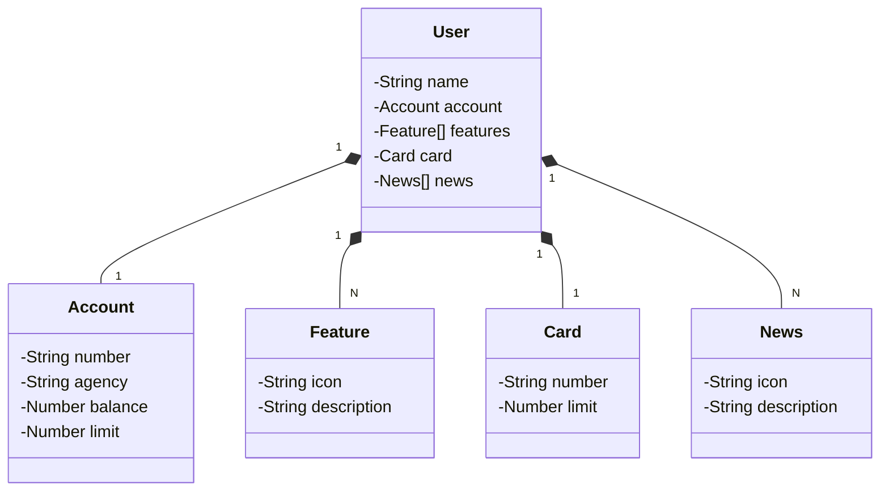

# Publicando Sua API REST na Nuvem Usando Spring Boot 3, Java 17 e Railway

Java RESTful API criada para o Bootcamp Bradesco - Java Cloud Native

## Principais Tecnologias
 - **Java 21**
 - **Spring Boot 3**
 - **Spring Data JPA**
 - **OpenAPI (Swagger)**
 - **Railway**

## Diagrama de Classes (Domínio da API)

## IMPORTANTE

Este projeto foi construído com um viés totalmente educacional para a DIO.

Para um desafio/referência mais completa é só acessar a
versão mais robusta dele no repositório oficial da DIO:

### [digitalinnovationone/santander-dev-week-2023-api](https://github.com/digitalinnovationone/santander-dev-week-2023-api)

Lá foram incluídos todos os endpoints de CRUD, além de aplicar boas práticas (uso de DTOs e refinamento na documentação da OpenAPI).
